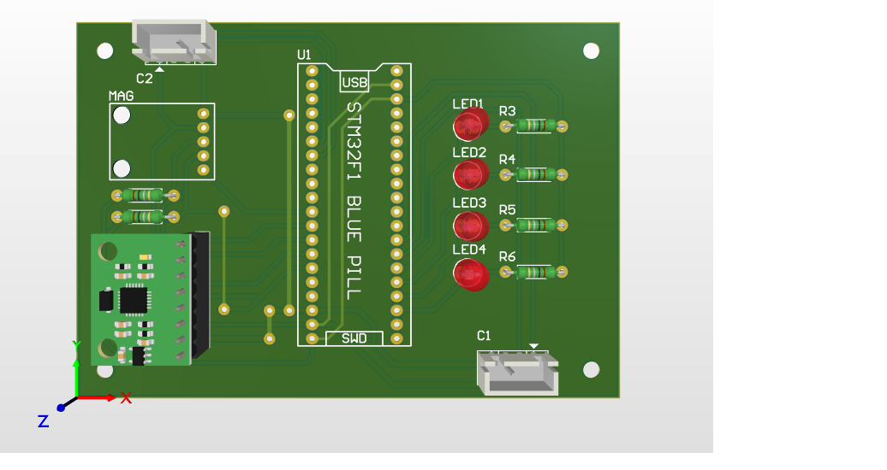
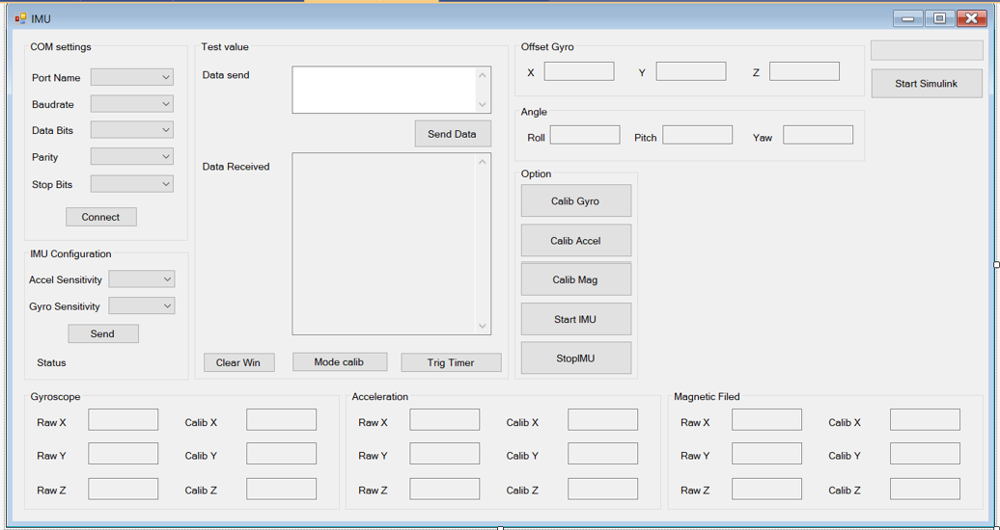
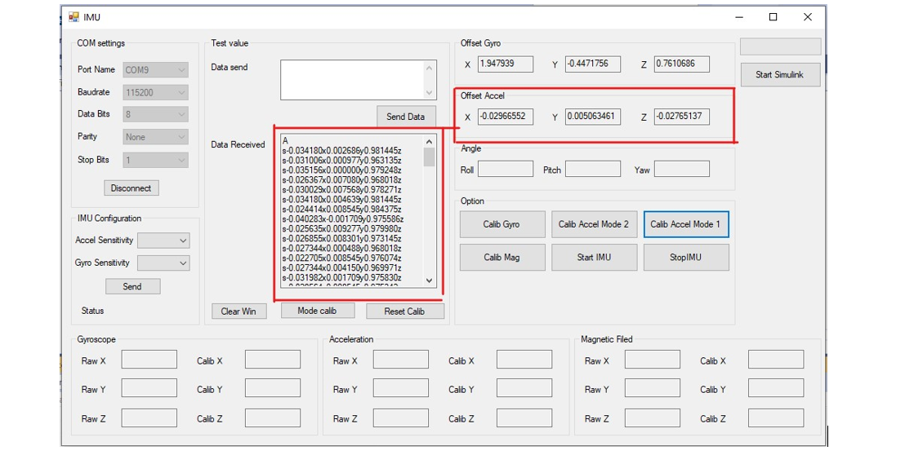
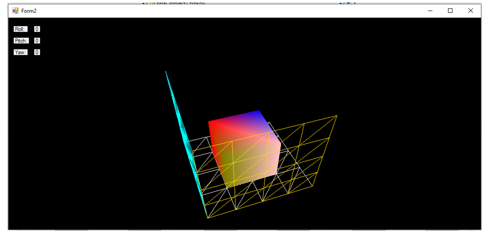
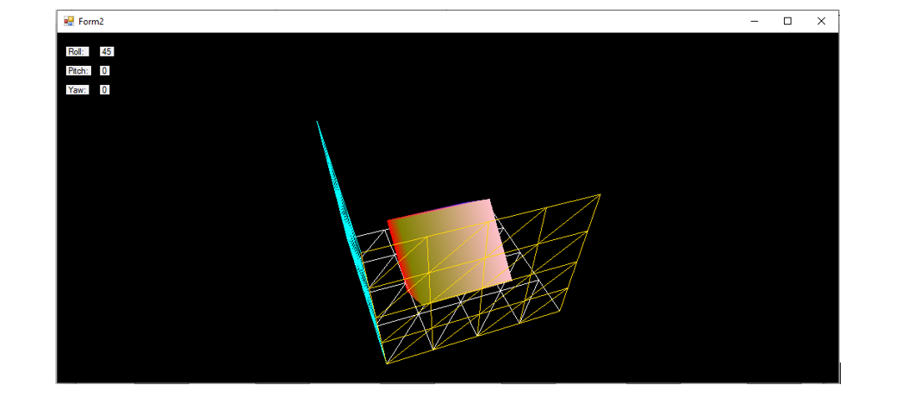
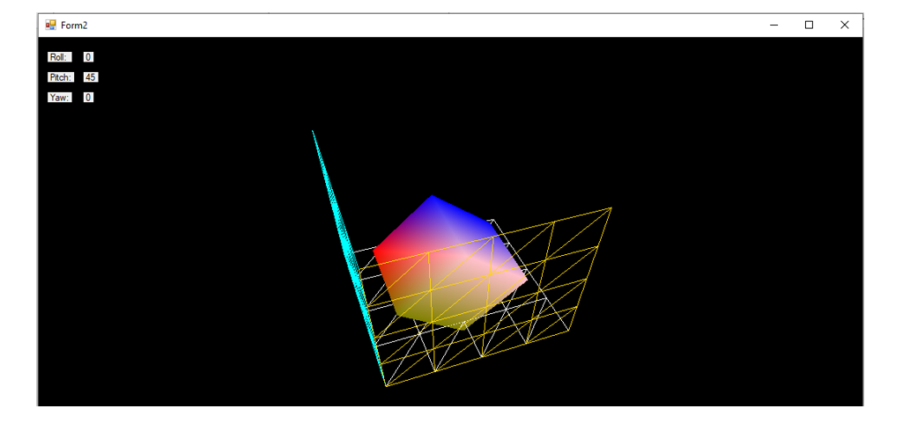
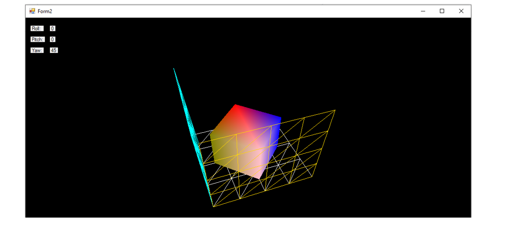

# IMU
9-DOF IMU using MPU6050 and QMC5883

### The hardware includes STM32F103, MPU6050 and QMC5883 ###

### GUI for connecting the UART and collecting data ###

### 3D GUI ###
#### Balance ####

#### Roll 45 degree ####

#### Pitch 45 degree ####

#### Yaw 45 degree ####

